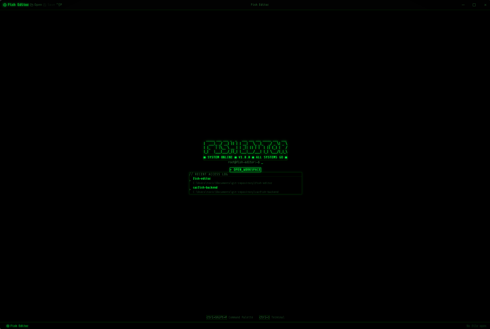
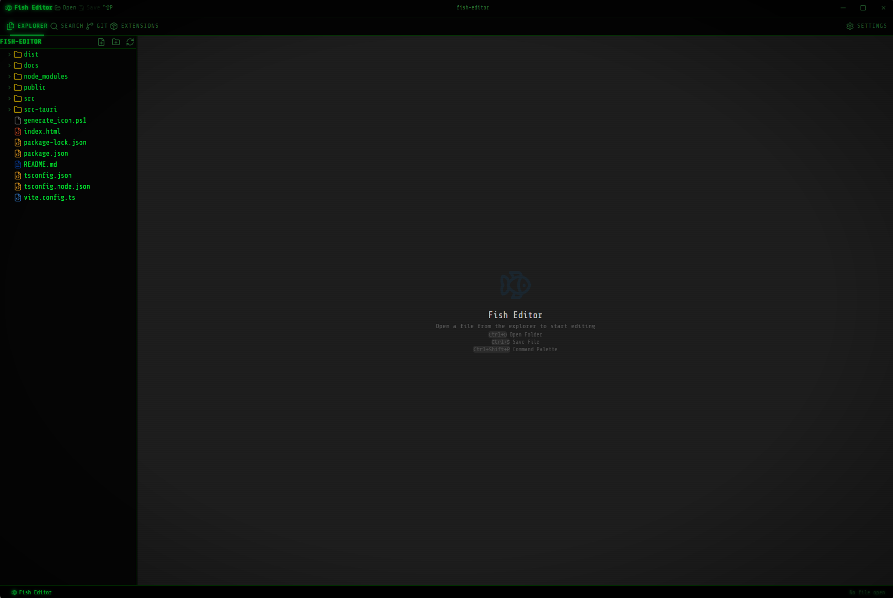

<h1 align="center">Fish Editor</h1>

<p align="center">
  A hacker-style code editor built with Tauri, Rust, and React — fast, minimal, and terminal-native.
</p>

<p align="center">
  
  
  
  
  
</p>

---

## Screenshots

<table>
  <tr>
    <td align="center">
      
      <br/><sub>Welcome Screen</sub>
    </td>
    <td align="center">
      
      <br/><sub>Editor with File Explorer</sub>
    </td>
  </tr>
</table>

---

## Features

- **Monaco Editor** — the same engine that powers VS Code, with syntax highlighting for dozens of languages
- **File Explorer** — full file tree with create, rename, delete, and context menu support
- **Integrated Terminal** — native PTY terminal powered by xterm.js, running PowerShell or your default shell
- **Git Integration** — working tree status, unified diff viewer, commit graph, branch switcher, and checkout
- **Image Viewer** — preview PNG, JPG, GIF, WebP, and SVG files directly inside the editor
- **Search Panel** — fast workspace-wide file search
- **Command Palette** — (`Ctrl+Shift+P`) quick access to all commands
- **Android Emulator** — embed and control AVD emulator windows directly inside the editor
- **Settings Panel** — configurable preferences
- **Hacker aesthetic** — full green-on-black terminal look throughout the UI

---

## Tech Stack

| Layer | Technology |
|---|---|
| Desktop shell | [Tauri 2](https://tauri.app) |
| Backend logic | Rust |
| UI framework | React 19 + TypeScript |
| Editor engine | Monaco Editor |
| Terminal | xterm.js + portable-pty |
| Styling | Tailwind CSS v4 |
| State | Zustand |
| UI components | Radix UI |

---

## Getting Started

### Prerequisites

- [Node.js](https://nodejs.org) 18+
- [Rust](https://rustup.rs) (stable toolchain)
- [Tauri CLI prerequisites](https://tauri.app/start/prerequisites/) for your platform

### Install & Run

```bash
# Clone the repository
git clone https://github.com/IsaelSousa/fish-editor.git
cd fish-editor

# Install JS dependencies
npm install

# Run in development mode
npm run tauri dev
```

### Build

```bash
npm run tauri build
```

The installer will be output to `src-tauri/target/release/bundle/`.

---

## Keyboard Shortcuts

| Shortcut | Action |
|---|---|
| `Ctrl+O` | Open Folder |
| `Ctrl+S` | Save File |
| `Ctrl+Shift+P` | Command Palette |
| `Ctrl+T` | Open Terminal |

---

## Project Structure

```
fish-editor/
├── src/                   # React frontend
│   ├── components/        # UI components (Editor, GitPanel, Terminal, ...)
│   ├── store/             # Zustand state management
│   └── utils/             # Helpers (language detection, icons, images)
├── src-tauri/             # Rust backend
│   └── src/
│       └── lib.rs         # Tauri commands (file system, git, PTY, Android)
└── docs/
    └── screenshots/       # Application screenshots
```

---

## License

MIT © [IsaelSousa](https://github.com/IsaelSousa)
